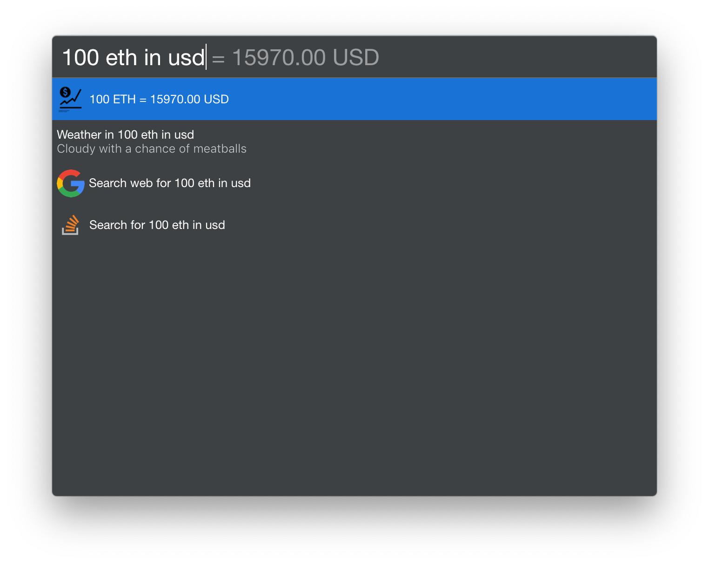

# cerebro-cryptocurrencies

**[Cerebro](http://www.cerebroapp.com)** plugin for converting currencies and cryptocurrencies

## Usage

Enter the **amount**, **currency code / cryptocurrency**, preposition **(to, in, at)** and **currency code / cryptocurrency**  
Example:  
**100 ETH in USD**  
**50 BTC at ETH**  
**0.5 USD to EUR**   

## Features
* Supports **3870** cryptocurrencies** and **41** currencies
* Support cryptocompare.com

## License

MIT © [Bartłomiej Zimny](http://raccoonsoftware.pl)
